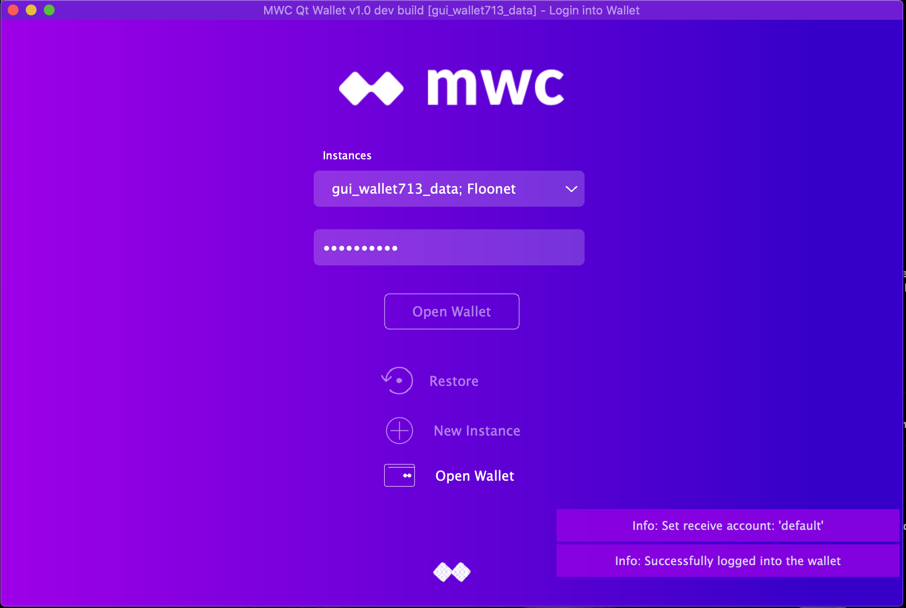
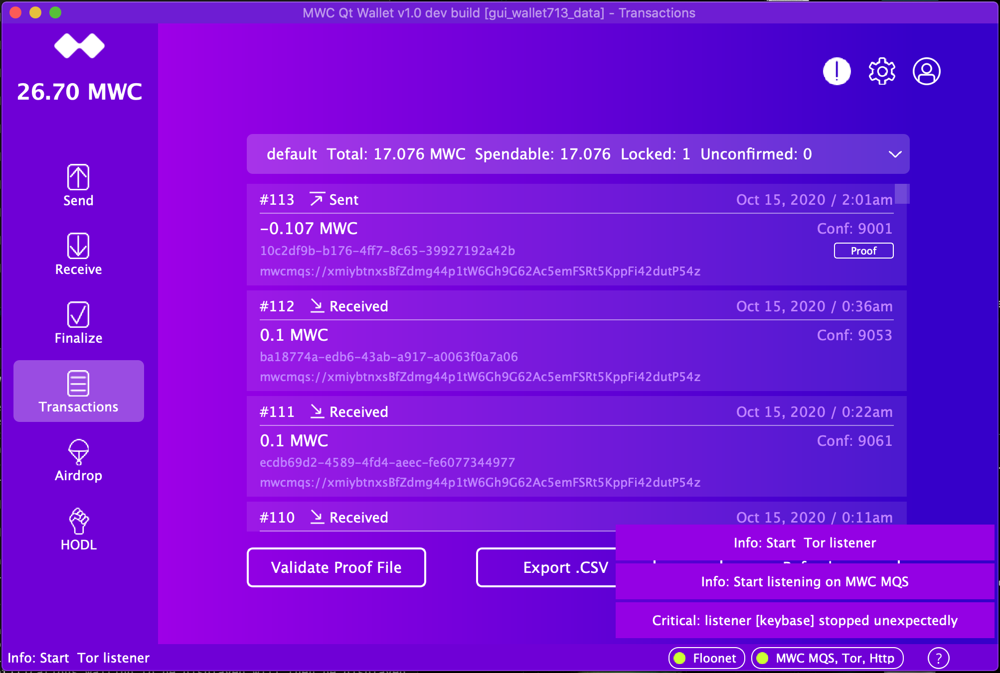
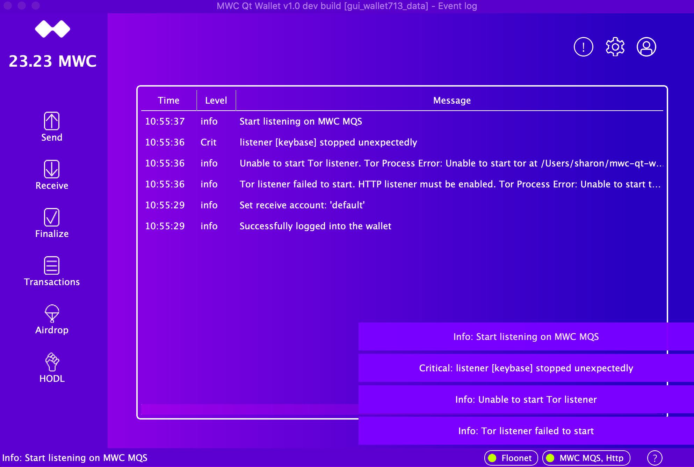
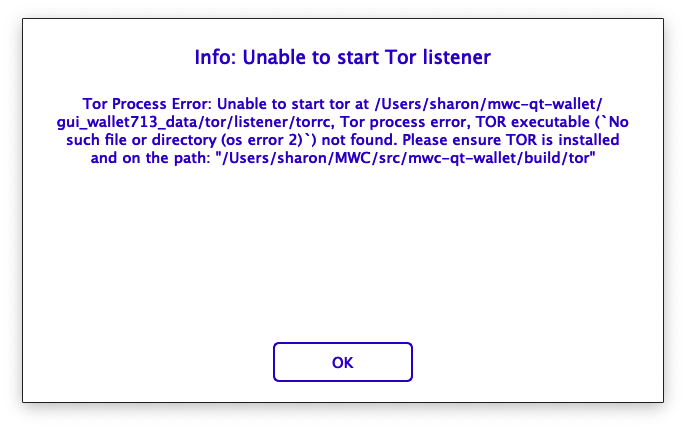
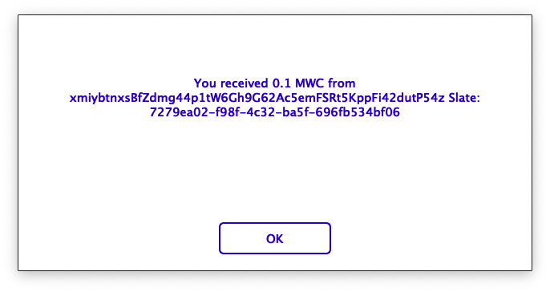
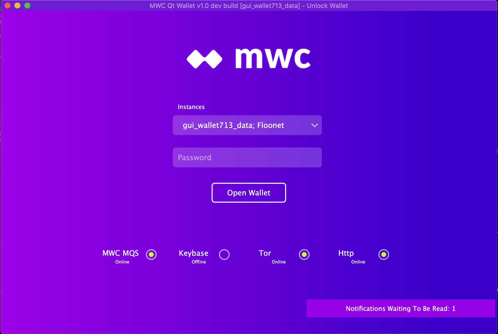

**MWC Qt Wallet**

Status Windows

Last Updated: August 5, 2020

# OVERVIEW

Currently we have some modals which are displayed when events occur that require the user to click on the modal to get rid of the window. This can be annoying to users as they have to stop what they are doing to get rid of the window that has now popped up on top of what they are doing whether they are using the wallet or not. To replace this type of modal, we’d like to briefly display a message in a window which appears in the lower right hand corner of the wallet.

Another issue is that the main window has a status bar, but it is difficult to read the messages as they appear in the status bar. The status bar messages can appear and disappear very quickly or the message will be cut off. So we’d like to use the new status windows to also display the status messages from the main window’s status bar.

The remainder of this document describes the new feature to display status messages, for a brief period of time, in windows which appear in the lower right hand corner of the wallet.

# General Status Window Behavior

When you first login to Qt Wallet, you will start to see status windows appear and disappear on the login screen and then continue to appear and disappear once the main Qt Wallet window is displayed.

The following describes the general behavior of the status windows:

1. Each notification that comes into Qt Wallet is displayed in a window in the lower right hand corner of the main Qt Wallet window. 

2. The status windows are displayed on top of whichever wallet screen you may be in and on top of whatever dialogs or modals which may currently be displayed. Anything not covered by a status window is still selectable/clickable.

3. Up to 5 windows can be visible at the same time. The first window displayed will be just above the main window status bar. Additional status windows will be displayed above the previous window.

4. Each status window fades in for 2 seconds, stays visible for 8 seconds, and then fades out for 2 seconds.

5. When a status window is done being displayed, the windows displayed above it will shift downward to take its place.

6. Status messages which come in but cannot be displayed because 5 windows are already being displayed, will be stored until there is room for them to be displayed.

7. A limit of 25 messages will be queued waiting to be displayed. If more than 25 messages are waiting to be displayed, the oldest messages will be removed from the queue and will not be displayed as a status message.

# Status Window Content

The status windows display the notification messages which are stored in the Event Log. There is a signal which triggers when messages come into Qt Wallet which the main window and the Event Log both listen for. The status windows are tied into the main window’s handling of status bar messages but does not replace the current use of the status bar. So there are 3 places where you can see the same notification message:

1. Main window status bar

2. Status window

3. Event log

For displaying in the status window, each notification message is parsed looking for a summary message to display for the notification. When the notification message is less than 50 characters, the summary message will be the same as the notification message. If the notification message is greater than 50 characters, the first sentence of the notification message is used as the summary. For example, if you look at the previous image, line 3 of the Event Log says: "Unable to start Tor listener. Tor Process Error: …" and the status window displays the first sentence “Unable to start Tor listener”. When a notification message is just one long string, the first 50 characters of the message are displayed followed by “...”. For some specific long messages, a hard-coded summary is used as what the message is really about is deeply embedded into the message.

Note: To support finding a status summary, some messages in mwc713 wallet were slightly modified (e.g. changed commas and colons to periods to end a sentence). In some cases, this modification also needed to be picked up in Qt Wallet as there are places in Qt Wallet which are looking for certain strings in the messages.

# Status Message Modal

To see the entire content of a notification message, you can click on the status window for the message. This will bring up a modal which displays the notification summary and the entire content of the message. The user will need to click the button in the modal for the modal to disappear.

In most cases the summary and the notification message, with the summary extracted from it, will be displayed in the modal.

The following is an example where the notification message was one long string so the summary contained the first 50 characters of the message. For notification messages of this type, the summary is not displayed along with the message. For this type of message only the original notification message is displayed. For long notification messages, extracting the summary as is done for other notifications sometimes leads to incomplete sentences which might not make sense.

Status windows will continue to appear on top of this modal as notifications arrive in the wallet. If the OK button is covered by the status windows, you can wait until the windows disappear or move the main window on the screen as dialog windows do not move with the main window. 

# Status Message Security

When Qt Wallet is locked, individual status messages are not displayed. Instead a single status message indicating how many messages are waiting to be read is displayed. As new notification messages come into Qt Wallet, the single window is displayed with the current count of pending messages to be read.

When the wallet is locked, you must unlock the wallet to see the notifications appear in the status windows. Clicking on the "Notifications Waiting To Be Read" status window makes the “Notifications Waiting” message disappear.

When the wallet is iconified, individual status messages are also not displayed and the same "Notifications Waiting" status window will be displayed as new notifications come in. When the wallet is iconified clicking on the “Notifications Waiting To Be Read” status window will restore the Qt Wallet to the screen. If the wallet is unlocked, the pending status messages will be displayed. If the wallet is locked, the pending status messages will be displayed once you unlock the wallet.

# Qt Wallet Main Window Resize and Movement

The size of the status windows is fixed. If you resize the Qt Wallet main window or change it to full screen, the status window size does not change.

If you move the Qt Wallet main window around, the status windows will follow it around and continue to display just above the main window status bar as usual. You will notice a slight lag between the main window movement and the status window movement. This is because the status windows are not directly embedded into the main window and they wait to be notified that the main window has moved. 

# Multi-Screen Behavior

When you start up the wallet on one screen and then switch to working on another screen, the notifications will continue to appear on the Qt Wallet main window. So it is possible to have Qt Wallet displayed on a separate monitor while you work on your laptop screen or vice versa.

When working on a laptop which allows you to swipe between screens (e.g. MacBook), if the wallet is running on one screen and you swipe to another screen, the notifications continue to appear and disappear while you are working on the other screen. To see the notifications you have missed, you will need to check the event log.

When the wallet is iconified, the "Notifications Waiting To Be Read" status window appears on the screen the user is actively using but in the lower right hand corner of the “available” window geometry. The available window geometry does not include the task bar.  So the status window will appear above the task bar. 

# Modals Which No Longer Appear

Now that status windows have been implemented, the following modals will no longer appear:

1. Modal when MWCs are received.

# Testing Notes

To test you will need to build both mwc713 and mwc-qt-wallet. Some changes were made to the notification messages in mwc713 and the severity of the Tor listener notifications was reduced from Critical to Info.

I have tested on a MacBook Pro with a 15 inch Retina Display running Catalina and an older MacBook Pro (late 2011) with a 13 inch (non-Retina) display running High Sierra.

I have started up a cold wallet and saw the status windows being displayed as I’d expect. A sanity check of clicking on the status windows, iconifying the wallet, moving the wallet, resizing the wallet all appear to work as expected.

# QA Focus

To QA this feature, I think it would help if QA focused on testing on Windows and Linux as I haven’t done any testing on those platforms.

